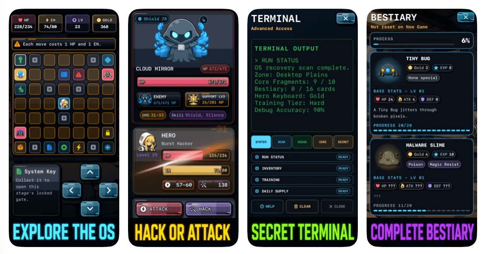

# RPG Offline: OS Core Quest

  

  <strong>A Turn-Based Cyber Roguelite RPG for iPhone and iPad.</strong>

  <a href="https://apps.apple.com/us/app/id6769058946">
    Download on the App Store
  </a>

---

## About the Game

You are a modern-day white-hat hacker.

After collapsing from exhaustion, you suddenly wake up in the year **2150** — trapped inside a dying digital world.

The **OS Core**, the heart of the entire network, has been shattered by a mysterious catastrophe. Rogue viruses, corrupted AI, and unstable data entities now control every region of the system.

As the last **Restorer Hero**, you must explore dangerous digital zones, recover the lost **Core Fragments**, and uncover the truth behind the collapse before the entire world is erased forever.

**Restore the Core. Uncover the truth. Decide the fate of the system.**

---

## Screenshots

  

---

---

## Features

### Turn-Based RPG Combat
Battle corrupted enemies using strategic turn-based combat.

### Explore a Digital World
Travel through unique cyber-themed regions inspired by operating systems, networks, archives, and corrupted data structures.

### Two Playable Heroes
Choose between different play styles and develop your own strategy.

### Roguelite Progression
Every run helps you grow stronger and discover new ways to survive.

### Hidden Secrets
Uncover optional lore, hidden story content, and multiple endings.

### Bestiary Collection
Hunt corrupted creatures, unlock monster entries, and complete your digital archive.

### Discover Hidden Commands
Unlock secret system functions inspired by classic computer terminals.

### Accessibility Support
Fully compatible with VoiceOver, allowing blind and visually impaired players to navigate maps, battles, rewards, and key game systems.

### 8 Languages Supported
Play in English, Japanese, Korean, German, Spanish, Portuguese, Chinese, or Vietnamese.

### Offline Gameplay
Play anytime, anywhere — no internet connection required.

### Lightweight & Battery Friendly
Optimized for smooth performance on both iPhone and iPad.

---

---

## Accessibility

VoiceOver support is available for blind and visually impaired players.

Supported areas include:

- Menus and navigation
- World map exploration
- Player position announcements
- Battles and combat actions
- Rewards and progression screens
- Important game events

Accessibility improvements continue to be expanded through community feedback.

---

## Supported Languages

- 🇺🇸 English
- 🇻🇳 Vietnamese
- 🇪🇸 Spanish
- 🇨🇳 Simplified Chinese
- 🇵🇹 Portuguese
- 🇩🇪 German
- 🇯🇵 Japanese
- 🇰🇷 Korean

The game automatically detects the device language on first launch.

---

## Download

Play **RPG Offline: OS Core Quest** on the App Store:

https://apps.apple.com/us/app/id6769058946

---

## Developer

Created by an independent solo developer.

Thank you for playing, sharing feedback, and supporting the project.
