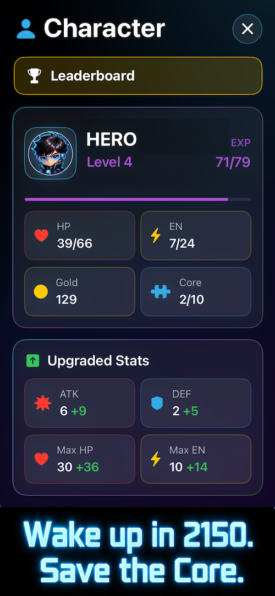
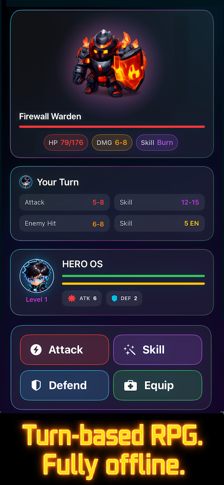
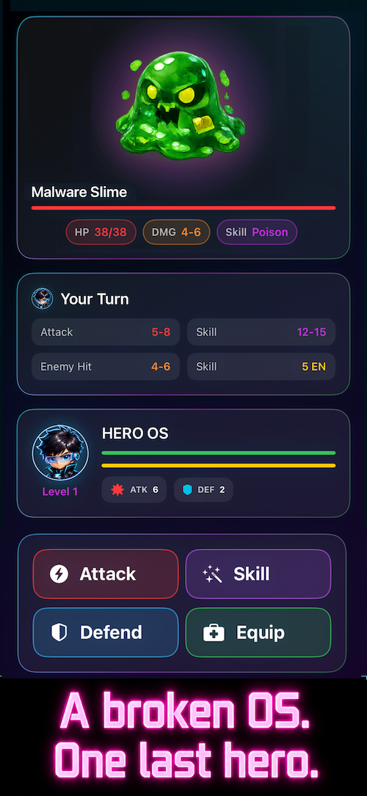

# RPG Offline: OS Core Quest

  

  <strong>An offline turn-based RPG set inside a collapsing digital world.</strong>

  <a href="https://apps.apple.com/us/app/id6769058946">
    Download on the App Store
  </a>

---

## About the Game

You are a modern-day white-hat hacker.

After countless sleepless nights, you collapse onto your keyboard… and wake up in the year 2150 — trapped inside a collapsing digital world.

The **Core System** — the heart of the entire network — has been shattered into fragments after a mysterious catastrophe. Rogue viruses, corrupted AI, and mutated data entities are taking over every region of the digital OS.

As the last **Restorer Hero**, you must explore broken OS zones, collect the lost **Core Fragments**, and restore the system before the entire digital world is erased forever.

**Uncover the mystery behind this collapsing world — and discover why you were brought here.**

---

## Screenshots

  
  
  

---

## Features

- Offline turn-based RPG gameplay
- Explore broken OS zones across a digital world
- Battle rogue viruses, corrupted AI, and data entities
- Collect lost Core Fragments to unlock the story
- Upgrade your hero, equipment, and skills
- Play anytime with no internet required

---

## Download

Play **RPG Offline: OS Core Quest** on the App Store:

https://apps.apple.com/us/app/id6769058946

---

## Developer

Created by an indie developer.

Thank you for playing and supporting the game!
